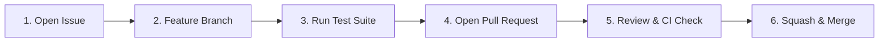

# Contributing to DocIntel

Thank you for your interest in contributing to **DocIntel**! We welcome contributions from engineers, data scientists, and open-source contributors.

This guide outlines our development standards, contribution process, testing rules, and dual-licensing framework.

---

## 📜 Table of Contents

1. [Code of Conduct](#code-of-conduct)
2. [Licensing & Commercial Boundary](#licensing--commercial-boundary)
3. [Developer Certificate of Origin (DCO)](#developer-certificate-of-origin-dco)
4. [Contribution Workflow](#contribution-workflow)
5. [Local Development & Setup](#local-development--setup)
6. [Testing Standards](#testing-standards)
7. [Commit Message Standards](#commit-message-standards)
8. [Security & Vulnerability Disclosure](#security--vulnerability-disclosure)

---

## 🤝 Code of Conduct

All contributors and maintainers are expected to adhere to professional, respectful, and inclusive communication across issues, PRs, discussions, and code reviews.

---

## ⚖️ Licensing & Commercial Boundary

DocIntel is distributed as open-source software under the **GNU Affero General Public License v3.0 (AGPL-3.0)**.

- **Open Source Contributions**: All contributions submitted to this repository will be licensed under the AGPL-3.0.
- **Commercial & Enterprise Licensing**: For organizations requiring closed-source deployments, proprietary SaaS embedding, or exemption from AGPL-3.0 copyleft obligations, commercial licensing is available via **OmniIntelOS**. See [`COMMERCIAL.md`](./COMMERCIAL.md) or contact `siddoyacinetech227@gmail.com`.

---

## ✍️ Developer Certificate of Origin (DCO)

All commits must include a Developer Certificate of Origin sign-off line using the `git commit -s` option:

```bash
git commit -s -m "feat(ocr): add adaptive table bounding box detection"
```

This certifies that you have the right to submit the code under the AGPL-3.0 license.

---

## 🔄 Contribution Workflow



1. **Issue First**: Open an issue describing bug details or proposed feature changes.
2. **Branching**: Create a clean branch from `master`:
   ```bash
   git checkout -b feat/your-feature-name
   # or
   git checkout -b fix/issue-description
   ```
3. **Develop & Validate**: Implement changes with offline unit tests.
4. **Pull Request**: Open a PR targeting `master`, referencing the related issue number.
5. **CI & Merge**: Address review notes; PR is merged upon CI green build.

---

## 🛠️ Local Development & Setup

### Prerequisites
- Python 3.11+
- Tesseract OCR / Surya OCR (optional for offline mocked test suite)
- Poppler utilities (for PDF rendering)

### Setup Instructions
```bash
# 1. Clone repository
git clone https://github.com/Yacine-ai-tech/DocIntel.git
cd DocIntel

# 2. Virtual environment setup
python3 -m venv venv
source venv/bin/activate

# 3. Install dependencies
pip install -e .
pip install -r requirements.txt

# 4. Copy environment template
cp .env.example .env
```

> **Zero Secret Mandate**: Offline testing does not require live OCR inference keys or remote cloud endpoints.

---

## 🧪 Testing Standards

DocIntel features a test suite covering table extraction, multipage document merging, currency normalization, and security token validations.

### Running the Test Suite
```bash
pytest tests/ -v
```

### Testing Rules
- Mock all third-party vision/LLM APIs in unit tests.
- Ensure all multi-page PDF edge cases (empty pages, rotated scans, malformed headers) are handled safely.
- Code changes must maintain 100% pass rate on existing test suites.

---

## 📝 Commit Message Standards

Follow [Conventional Commits](https://www.conventionalcommits.org/):

| Prefix | Description |
| :--- | :--- |
| `feat:` | New features or pipeline components |
| `fix:` | Bug fixes |
| `docs:` | Documentation updates |
| `test:` | Adding or improving tests |
| `refactor:` | Code changes without external behavior modification |
| `perf:` | Performance improvements |
| `chore:` | Tooling, dependencies, or configuration changes |

---

## 🔒 Security & Vulnerability Disclosure

To report security vulnerabilities, please email `siddoyacinetech227@gmail.com` directly. Do not file public GitHub issues for security reports.
